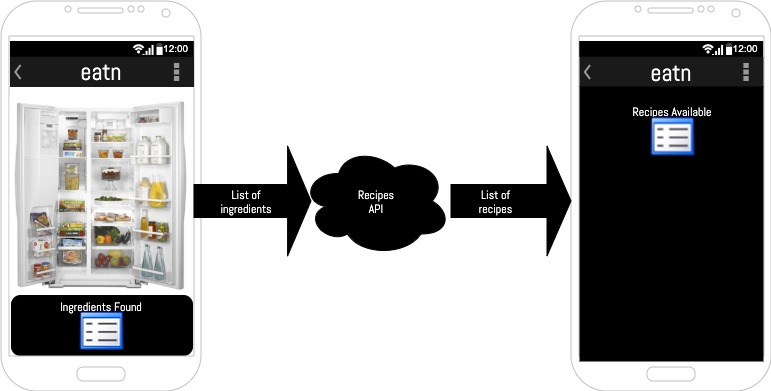

# eatn
## Tell us what your idea is
An augmented-reality app that uses object identification to find simple recipes using the ingredients you have. **eatn** uses a trained TensorFlow model as an on-device solution. The hungry user takes a picture of the ingredients at their disposal, the app identifies them, and suggests recipes. Submitting for the #AndroidDevChallenge. Full cover letter is [here](docs/eatn-cover-letter.docx).

  

## Tell us how you plan on bringing it to life
Describe where your project is, how you could use Google’s help in the endeavor, and how you plan on using On-Device ML technology to bring the concept to life. The best submissions have a great idea combined with a concrete path of where you plan on going, which should include: 

1.) any potential sample code you’ve already written
> * I have forked the [TensorFlow Object Detection Demo](https://github.com/thomasphillips3/examples/tree/master/lite/examples/object_detection/android), which will be used as a starting point.

2.) a list of the ways you could use Google’s help,
> * I am an aspiring Android developer, teaching myself and learning on the job. I would like Google to provide guidance through the development process. I would like help dividing the project into manageable chunks, helping unblock me when I get stuck, and providing feedback on best-practices while creating a proof of concept/ minimum viable product.

3.) as well as the timeline on how you plan on bringing it to life by May 1, 2020.
> * I am not completely sure of all the steps required, but here’s my estimation
  > |Objective|Completion date|Key Result|
  > |---|---|---|
  > |Design user scenarios|January 1, 2020|Specification document|
  > |Design an interface around the scenarios|January 1, 2020|Specification document|
  > |Train and deploy the TensorFlow model necessary to identify foods, maybe using a small subset initially (e.g. breakfast recipes only)|February 1, 2020|TensorFlow model deployed. App can identify foods and save them to a list|
  > |Use the list of foods to call a recipes API (e.g. Edamam)|March 1, 2020|App displays a list of possible recipe matches|